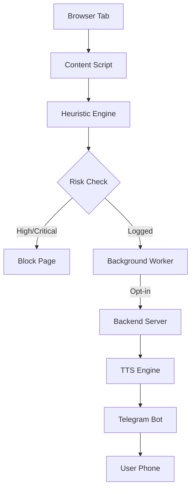

# 🛡️ AntiPhish Guardian

[](https://github.com/your-username/anti-phish-extension)
[](https://opensource.org/licenses/MIT)
[](https://developer.chrome.com/docs/extensions/)

**AntiPhish Guardian** is a powerful, multi-layered browser extension designed to protect users from sophisticated phishing attacks, AI-driven manipulation, and malicious extensions. It combines deterministic rule-based analysis with advanced heuristic detection and real-time remote alerts.

---

## 🚀 Key Features

### 1. 🧠 Intelligent Heuristic Analysis (Phase 2)
Real-time scanning of page content to detect phishing patterns:
- **Risk Scoring:** Computes a 0.0 to 1.0 risk score for every site.
- **Explainable Results:** Provides clear reasons like "Suspicious keywords," "Mismatched domains," or "Hidden password fields."
- **Interactive Popup:** Visualizes the risk level (Low, Medium, High, Critical) instantly.

### 2. 🛡️ Auto-Protection & Blocking (Phase 3)
Active defense that intercepts threats before they can cause harm:
- **Pre-emptive Blocking:** Automatically blocks access to high-risk URLs.
- **Custom Block Pages:** Professional warnings explaining why a site was blocked.
- **Allowlist Management:** Securely bypass false positives for trusted domains.

### 3. 🤖 AI Manipulation & Prompt Injection Defense (Phase 5)
Advanced protection against modern AI-based threats:
- **Prompt Injection Scanning:** Detects malicious instructions designed to manipulate LLM-based tools.
- **Visual Feedback:** Alerts users to suspicious patterns in text fields and inputs.

### 4. 📞 Remote Telegram Voice Alerts (Phase 7)
Real-time, cross-device security notifications:
- **TTS Summaries:** Generates voice alerts via ElevenLabs or Sarvam AI.
- **Telegram Bot Integration:** Delivers incident summaries directly to your phone.
- **Privacy First:** Only sends URL, score, and reasons—never your personal data or cookies.

---

## 🛠️ Installation & Setup

### Extension (Client)
1. Clone this repository or download the source.
2. Open Chrome and navigate to `chrome://extensions`.
3. Enable **Developer mode** (toggle in the top-right).
4. Click **Load unpacked** and select the root directory of this project.

### Backend (Telegram Alerts)
The backend is required for Telegram voice notifications.
1. Navigate to the `backend` directory:
   ```bash
   cd backend
   ```
2. Install dependencies:
   ```bash
   npm install
   ```
3. Configure your environment:
   ```bash
   cp .env.example .env
   # Edit .env with your TELEGRAM_BOT_TOKEN and TTS_API_KEY
   ```
4. Start the server:
   ```bash
   npm start
   ```

---

## 📐 Technical Architecture



---

## 🔒 Security & Privacy
- **Local First:** Most analysis happens entirely within your browser.
- **Data Minimization:** We only send necessary metadata for remote alerts.
- **Consent Driven:** Remote features require explicit user opt-in via a consent dialog.
- **No Persistence:** We do not store your browsing history or personal identifiers.

---

## 📄 License
This project is licensed under the MIT License - see the [LICENSE](LICENSE) file for details.

---

*Built for the KU Hackathon — Protecting the web, one click at a time.*
